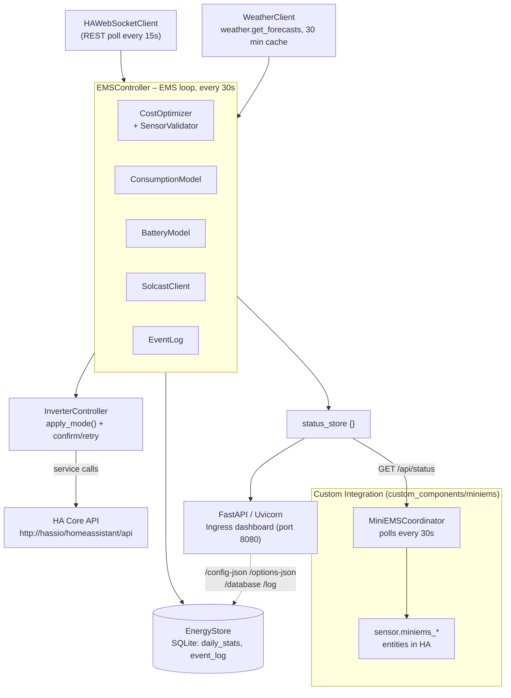
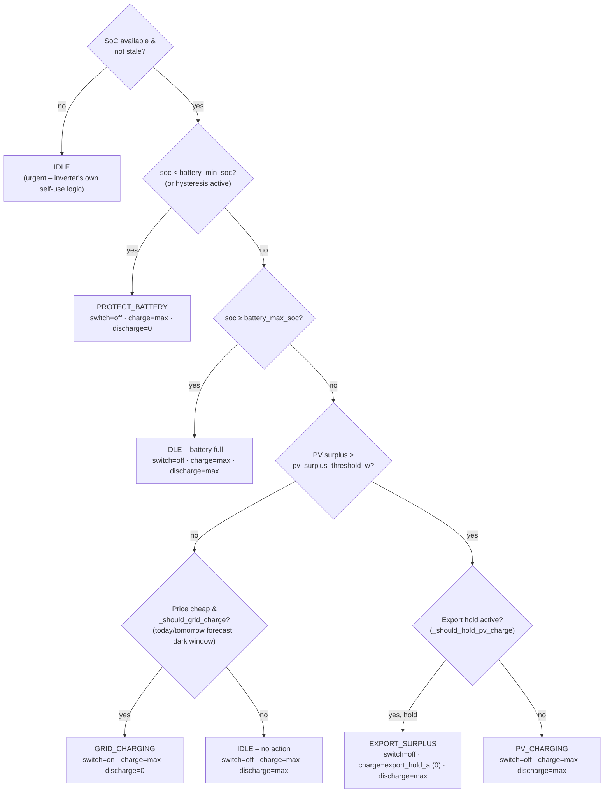
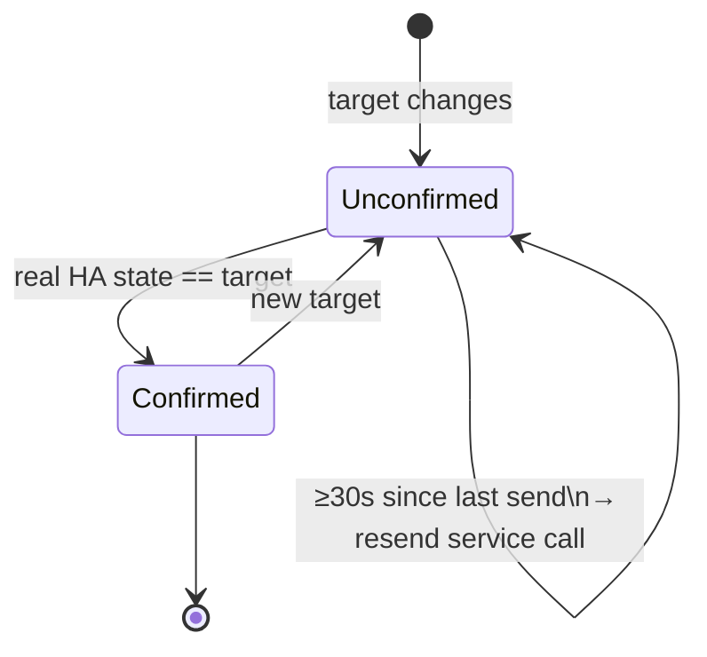

# Architecture

## Component Overview



`InverterController` and `HAWebSocketClient` both talk directly to the `HA Core API`; the `sensor.miniems_*` entities are **not** pushed from the add-on — they are pulled by the Custom Integration via HTTP from `/api/status` (see "Sensor Publishing" below).

## Asyncio Task Graph

Three long-running tasks run concurrently:

```
asyncio.gather(
  ws_client.run()      # polls HA states every 15 s
  _ems_task()          # waits for ready → runs EMS loop every 30 s
  uvi_server.serve()   # FastAPI / Uvicorn HTTP server on port 8080
)
```

`_ems_task` waits on `ws_client.wait_ready()` (an `asyncio.Event`) before
starting, preventing the EMS from running on stale/empty state.

## Sub-system Wiring (per tick)

```
EMSController.update()
  │
  ├─ ws.get_state_value(...)        # read raw sensors (PV/load/grid/SoC/price/…)
  ├─ BatteryModel.free_to_charge()  # kWh headroom calculation
  ├─ BatteryModel.useable()         # kWh discharge capacity
  ├─ ConsumptionModel.predict()     # predicted_load_kwh + source label (uses WeatherClient)
  ├─ _determine_mode()              # _decide() + _commit() → EMSMode (see "Decisions & Control")
  ├─ EventLog.append()              # on mode change OR price change
  ├─ InverterController.apply_mode()# send commands + confirm against real state (see below)
  ├─ CostOptimizer.record_tick()    # energy/cost accumulators
  │    └─ SensorValidator.validate()#   rejects power spikes ONLY for cost/energy accounting –
  │                                 #   the mode logic above reads the raw values unfiltered
  └─ return status_store {}         # fetched by web_server (/api/status) and the Custom Integration
```

!!! note "SensorValidator is not on the decision path"
    `SensorValidator.validate()` is called from `CostOptimizer.record_tick()`, not directly from `EMSController.update()`. A rejected power spike only affects energy/cost accounting — the mode decision (`_decide`) always works on the raw, unfiltered values from `HAWebSocketClient` and relies on its own staleness checks instead (see [Calculations](calculations.md)).

## Authentication Flow

```
SUPERVISOR_TOKEN  ──▶  http://hassio/homeassistant/api
       │ 401?
       ▼
long_lived_token  ──▶  http://hassio/homeassistant/api
       │ 401?
       ▼
    Log error, retry in 10 s
```

Both `HAWebSocketClient` (reads) and `InverterController` (writes) implement
this fallback independently so each can switch tokens at runtime.

`SUPERVISOR_TOKEN` is also used by:

- `WeatherClient` — to call `weather.get_forecasts` and fetch HA latitude
- `web_server.py` — to query `http://supervisor/core/api/config` for the HA
  language (de/en auto-detection)
- `integration_installer.py` — to install/update the Custom Integration
  files under `/config/custom_components/miniems`

## Sensor Publishing: Custom Integration (Pull)

`sensor.miniems_*` entities are **not** pushed from the add-on to HA — they
come from a bundled HA Custom Integration (`custom_components/miniems`,
installed by `integration_installer.py`):

| Component | Role |
|---|---|
| `MiniEMSCoordinator` (`DataUpdateCoordinator`) | Polls `GET http://homeassistant:8080/api/status` (default every 30 s) |
| `MiniEMSSensor` (`SensorEntity`) | Reads the desired fields from the coordinator's result (the `status_store` JSON) |

There is currently **no** MQTT discovery or REST push mechanism inside the add-on itself — sensors are created exclusively through this pull path.

## Sensor Validation (SensorValidator)

Power readings are validated on every tick for cost/energy accounting (not for the mode logic, see above) to reject implausible spikes:

```
reject if: |current − last_accepted| > 500 W  AND  |Δ| / last_accepted > 50%
```

Rejected readings return `None`; `CostOptimizer` skips the tick for that sensor.
Each entity is tracked independently.

## Downtime Gap Detection

On startup, `CostOptimizer` reads `last_flush_ts` from the SQLite `daily_stats`
table (`EnergyStore`, `/data/miniems.db`). If the gap between `last_flush_ts`
and `datetime.now(timezone.utc)` exceeds two update intervals, a data-gap
warning is raised and surfaced in the dashboard warnings banner.

## Decisions & Control

The full formulas and thresholds live in [Calculations](calculations.md); the two diagrams here show the control flow at a glance.

### Mode Decision (`EMSController._decide`)



Every branch is **fail closed**: a missing or stale required sensor value always resolves to the safer outcome (no grid charging, no holding back PV charging). `_commit()` additionally debounces a newly proposed mode via `mode_dwell_sec`, unless the decision is `urgent` (SoC protection, missing SoC sensor, an export hold ended by a safety guard).

### Inverter Write Confirmation (`InverterController`, since v2.0.1)

Per channel (charge current, discharge current, grid-charge switch), independently — a service call HA accepted only counts as confirmed once the real state actually matches:



`write_unconfirmed` (0–3) is a live count of how many channels are currently unconfirmed; `write_errors` separately counts outright HTTP/connection failures. Both surface as warnings in the dashboard banner.

## Internationalisation (i18n)

On each page request, `web_server.py` queries `http://supervisor/core/api/config`
to determine the HA language (`language` field). The corresponding YAML file
(`translations/de.yaml` or `translations/en.yaml`) is loaded and injected into
both Jinja2 templates and the JavaScript `const T` object so that dynamically
rendered cards are also translated.

Fallback order: HA Supervisor API → `Accept-Language` header → English.

## Dashboard & API Routes (`web_server.py`)

| Route | Purpose |
|---|---|
| `/` | Dashboard (HTML) |
| `/settings` | Settings page (HTML) |
| `/log` | Event log (HTML) |
| `/database` | Database viewer (HTML) |
| `/config-json`, `/options-json` | Raw file editors (HTML) |
| `/api/status` | **Live status values as JSON — polled by the Custom Integration** |
| `/api/database` | Database export as JSON |
| `/api/config` (GET/POST) | Read/write configuration |
| `/api/rawfile/{name}` (GET/POST) | Read/write raw file editors (config.json/options.json) |
