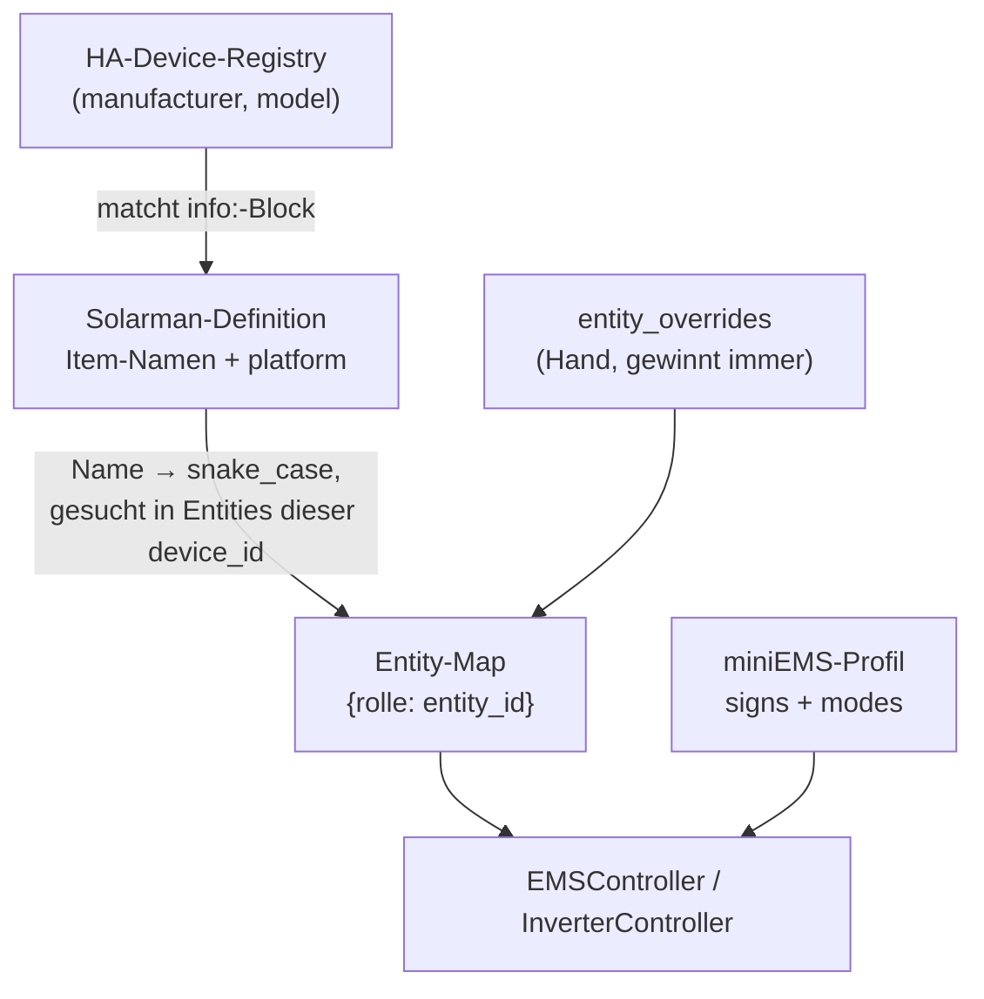

# miniEMS v3.0 – Geräteprofile auf Basis der Solarman-Definitionen

!!! info "Status: Planung"
    Dieses Dokument beschreibt einen geplanten, noch **nicht umgesetzten** Release. Es dient der Abstimmung und wird bei der Umsetzung fortgeschrieben. Der aktuell ausgelieferte Stand ist v2.0.2.

## Context

miniEMS ist heute an genau einen Wechselrichter gebunden: **17 Entity-IDs** stehen einzeln in `Config` (`config_loader.py:37–93`), Einheiten (Ampere), Vorzeichen-Konventionen und die Steuer-Strategie pro EMS-Modus sind fest im Python-Code verdrahtet (`inverter_controller.apply_mode()`, `const.BATTERY_MAX_CURRENT_A = 350`). Ein anderer Wechselrichter ist praktisch nicht anschließbar.

Drei Belege für den Schmerz:

1. **Die Defaults sind schon für den eigenen Deye falsch.** `pv_power_entity` steht auf `sensor.deye_pv_total_power`, real ist es `sensor.deye8k_pv_power`; `battery_soc_entity` auf `sensor.deye_battery_soc`, real `sensor.deye8k_battery`. Fünf der 17 Defaults nutzen `deye_`, die anderen zwölf `deye8k_` — jede Neuinstallation muss 17 Felder von Hand nachziehen.
2. **Die Vorzeichen-Konvention widerspricht sich im Repo.** `cost_optimizer.py:192` sagt „> 0 = discharging", `docs/user/configuration.md:35` sagt „positiv = Laden". Live verifiziert: bei `battery_power = −29 W` melden `battery_power_charge = 29` und `battery_power_discharge = 0` → **negativ = Laden**; der Code hat recht, die Doku ist falsch.
3. **v2.0.0 war bereits ein Breaking Release wegen dieser Kopplung** (Watt → Ampere, Migration v11), weil die Einheit des Geräts im Code stand statt in einer Gerätebeschreibung.

Ziel: Gerätewissen deklarativ halten, damit ein anderer Wechselrichter ohne Python-Änderung anbindbar ist — und dabei **nicht neu erfinden, was gepflegt schon existiert**.

## Der entscheidende Hebel: die Solarman-Definitionen wiederverwenden

`custom_components/solarman/inverter_definitions/` enthält **30 gepflegte YAML-Gerätedefinitionen** — genau das Format, das miniEMS bräuchte, vom Upstream-Maintainer aktuell gehalten:

```yaml
# deye_p3.yaml – DAS ist unser Gerät
info:
  manufacturer: Deye
  model: [SG0*LP3, SG0*HP3]
```

| Definition | manufacturer | model | Bezug zur Anlage |
|---|---|---|---|
| `deye_p3.yaml` | Deye | `[SG0*LP3, SG0*HP3]` | ✅ **unser Wechselrichter** |
| `deye_hybrid.yaml` | Deye | `SG0*LP1` | ⚠️ *nicht* unser Gerät (1-phasig) |
| `deye_micro.yaml` | Deye | `Microinverter` | die beiden „BKW"-Geräte |
| `pylontech_force.yaml` | Pylontech | `[Force H1, H2, H3]` | **Batterie als eigene Definition** |

Der `info:`-Block matcht **exakt** die HA-Device-Registry (`"manufacturer":"Deye","model":"SG0*LP3"`). Der `*` ist keine Glob-Syntax — die Registry enthält den String literal, Matching ist einfacher Vergleich. Die Definition liefert je Item `name`, `platform`, `uom`, `range`, `class`:

```yaml
# deye_p3.yaml Z. 335 ff.        →  HA-Entity-Attribute (live geprüft)
platform: number                     "min": 0, "max": 350, "step": 1.0
uom: "A"                             "unit_of_measurement": "A"
range: {min: 0, max: 350}            "device_class": "current"
```

`const.BATTERY_MAX_CURRENT_A = 350` in miniEMS ist damit die **dritte Kopie** derselben Zahl.

!!! note "Gemeinsame Grundlage mit der Netzdienlichkeits-Roadmap"
    Grenzen und Einheiten aus Entity-Attributen zu lesen setzt voraus, dass miniEMS Attribute überhaupt liest — heute passiert das **nirgends** im Code (`get_state_value()` parst nur den `state` als float). Derselbe Zugriff ist auch die Grundlage für [Netzdienliches Laden](netzdienliches-laden.md) (Tarifkalender, halbstündliche PV-Kurve). Er sollte einmal gebaut und von beiden Vorhaben genutzt werden — welches zuerst kommt, ist offen.

### Machbarkeit verifiziert

- Der laufende Add-on-Container **sieht alle 30 Dateien** unter `/config/custom_components/solarman/inverter_definitions/` (`/config` ist gemountet).
- **PyYAML 6.0.3** ist im Container vorhanden — keine neue Abhängigkeit nötig.

### Was die Definitionen *nicht* liefern — und miniEMS deshalb selbst deklariert

- **Semantische Rollen.** Die Definition kennt ein Item `"Battery"`, aber nicht, dass das die SoC-Rolle des EMS ist.
- **Vorzeichen-Konvention.** Es gibt zwar `attributes: [inverse]` an `"Battery Power"`, aber `entity.py:61` wertet nur den Schlüssel `inverse_sensor` aus und erzeugt damit lediglich ein Anzeige-Attribut `−x`. Das ist **kein dokumentierter Vertrag** und inkonsistent gesetzt → miniEMS deklariert das Vorzeichen selbst (empirisch bestätigt, s. o.).
- **Modus-Strategie.** Wie „Netzladen" auf Stellglieder abgebildet wird, ist EMS-Logik, kein Gerätewissen.

### Namenskonsistenz — trägt für einen generischen Rollen-Katalog

| Item-Name | in n/30 Definitionen |
|---|---|
| `"Battery"` (SoC) | 18 |
| `"PV Power"` | 18 |
| `"Battery Power"` | 15 |
| `"Load Power"` | 14 |
| `"Grid Power"` | 9 |
| `"Battery Max Charging Current"` | **2** (`deye_hybrid`, `deye_p3`) |
| `"Battery Grid Charging"` | **3** (+ `kstar_hybrid`) |

Sensor-Namen sind konsistent, wo das Gerät die Größe überhaupt hat. **Steuerbar sind heute nur 2–3 Definitionen** — die übrigen sind String-Wechselrichter ohne Batterie. Ein einziger generischer Rollen-Katalog plus wenige Ausnahmen reicht also.

## Vergleich mit evcc

[evcc](https://github.com/evcc-io/evcc) hat mit `templates/definition/{meter,charger,vehicle}/*.yaml` ein eigenes Gerätetemplate-System — auf den ersten Blick dieselbe Aufgabe. Es löst aber ein anderes Problem: evcc hat **keine Integration unter sich**, die schon mit dem Gerät spricht; sein `render:`-Block (Go-Template-Syntax) erzeugt selbst den Modbus-Register-Zugriff bzw. den REST-Treiber. Bei uns übernimmt genau das bereits Solarman. Unser Plan, dessen Definitionen wiederzuverwenden statt eigene Register-Maps zu schreiben, ist evccs Idee — nur eine Ebene höher angesetzt, dort wo HA das Gerät bereits ausgelesen hat. Ein direkter Import der evcc-Templates wäre deshalb die falsche Schicht: sie encodieren Protokolldetails, die wir nie brauchen.

Bemerkenswert auch: evcc hat **keine** Auto-Discovery — ein Template wird in der UI immer manuell aus einer Liste gewählt, weil evcc keine eigene Geräte-Registry hat. Unser Registry-Match auf `(manufacturer, model)` gegen die HA-Device-Registry ist dem also bereits voraus.

Drei Einzelideen aus evcc lohnen sich trotzdem:

| evcc-Idee | Fundstelle | Übernahme hier |
|---|---|---|
| `caveats` — bekannte Eigenheiten je Gerät, sprachvariant, mit Pflicht-Link auf ein Issue | `templates/README.md` | `caveats:` in `profiles/*.yaml`, sichtbar in der Mapping-Vorschau der Einstellungen |
| Validierung durch echten Verbindungsversuch — Config wird instanziiert und ein Live-Wert gelesen, bevor sie gespeichert wird, statt nur Schema-Prüfung | DeepWiki-Beschreibung des Validierungs-Endpunkts | Phase 3: je aufgelöster Pflichtrolle einen Wert live lesen und in der Mapping-Vorschau zeigen, bevor gespeichert wird |
| `service`-Parameter — ein Dropdown wird zur Laufzeit aus einer echten Quelle befüllt (z. B. verfügbare Ports), statt Freitext | `templates/README.md`, Parameter-Attribut `service` | Override-Feld für offene Pflichtrollen: Dropdown aus den Entities des erkannten Geräts, gefiltert nach passendem `device_class`/`unit_of_measurement`, statt freier `entity_id`-Eingabe |

Nicht übernommen: `capabilities`/`requirements` (1p3p, RFID, eebus, sponsorship — Ladepunkt-Domäne ohne Gegenstück bei einem Wechselrichter), `usage: [grid, pv, battery]` an Meter-Templates (deckt sich bereits mit unserem Slot-Konzept `inverter`/`battery`), Go-Template-Render (bei uns unnötig, da keine Protokoll-Generierung stattfindet).

## Zielarchitektur

Zwei sauber getrennte Fragen:

**A. Welche Entity erfüllt Rolle X?** → Solarman-Definition (Item-Name + `platform`), aufgelöst innerhalb der Entities des erkannten Geräts. Einheiten/Grenzen aus den HA-Attributen.

**B. Was bedeutet Rolle X, und wie steuere ich Modi?** → miniEMS-eigene Semantikschicht, klein.

### Auflösungskette



### miniEMS-eigene Dateien (klein, das ist der ganze Zusatz)

```yaml
# roles.yaml – generischer Katalog, gilt für alle Geräte
battery_soc:      ["Battery", "Battery SOC"]
battery_power:    ["Battery Power"]
grid_power:       ["Grid Power"]
load_power:       ["Load Power"]
pv_power:         ["PV Power"]
charge_limit:     ["Battery Max Charging Current"]
discharge_limit:  ["Battery Max Discharging Current"]
grid_charge:      ["Battery Grid Charging"]
```

```yaml
# profiles/deye_p3.yaml – nur was Solarman nicht ausdrücken kann
match: {manufacturer: Deye, model: [SG0*LP3, SG0*HP3]}   # model PFLICHT
slot: inverter
signs:
  battery_power: negative_is_charge      # empirisch verifiziert
  grid_power:    positive_is_import
modes:                                   # EMSMode → Sollwerte je Stellglied
  GRID_CHARGING:   {grid_charge: true,  charge_limit: rated, discharge_limit: 0}
  PV_CHARGING:     {grid_charge: false, charge_limit: rated, discharge_limit: rated}
  EXPORT_SURPLUS:  {grid_charge: false, charge_limit: hold,  discharge_limit: rated}
  PROTECT_BATTERY: {grid_charge: false, charge_limit: rated, discharge_limit: 0}
  IDLE:            {grid_charge: false, charge_limit: rated, discharge_limit: rated}
caveats:                                 # bekannte Eigenheiten, s. Vergleich mit evcc
  - "Tageszähler des WR rollen ~4:54 min nach lokaler Mitternacht über –
     kWh-Größen deshalb aus Lebenszeit-Zählern ableiten, nicht aus den
     Tageswerten des Geräts."
  - "Solarman ist Poll-basiert: ein geschriebener Sollwert wird erst mit dem
     nächsten Poll zurückgemeldet, nicht sofort. Unconfirmed writes bis dahin
     sind normal."
```

`rated`/`hold` lösen sich gegen die HA-Attribute (`max`) bzw. `export_hold_charge_current_a` auf — keine Einheiten oder Grenzen im Profil. `caveats` ist rein informativ (Anzeige in den Einstellungen), fließt nicht in die Steuerlogik ein.

### Kein Zwang zu Solarman

Nicht jeder Nutzer hat die Integration (Fronius/SMA/Victron). Die Definitionen sind ein **optionaler Beschleuniger**, keine harte Abhängigkeit. Auflösungspriorität je Rolle:

1. `entity_overrides` (Hand)
2. Solarman-Definition, falls Verzeichnis vorhanden **und** Gerät gematcht
3. generische Heuristik aus `roles.yaml` gegen die Entity-IDs des Geräts
4. offen → in den Einstellungen als „fehlende Rolle" mit Override-Feld sichtbar

Fehlt das Verzeichnis komplett, funktioniert Weg 3+4 weiterhin. **Upstream-Umbenennungen brechen nie still**: Eine nicht auflösbare Pflichtrolle ist ein sichtbarer Fehlerzustand, kein stiller Fehlgriff.

Das Override-Feld aus Schritt 4 ist kein Freitext für die `entity_id`, sondern ein Dropdown, befüllt aus den tatsächlichen Entities des erkannten Geräts (gefiltert nach passendem `device_class`/`unit_of_measurement` der Rolle) — dieselbe Idee wie evccs `service`-Parameter, s. [Vergleich mit evcc](#vergleich-mit-evcc). Vertippte oder nicht mehr existierende Entity-IDs werden damit beim Konfigurieren unmöglich statt erst beim ersten Tick sichtbar.

### Geräteauswahl ist an Hersteller **und** Modell gebunden

In der Registry der Produktivanlage stehen vier Deye-Geräte:

| device_id | model | Ergebnis |
|---|---|---|
| `012162…` | SG0\*LP3 | ✅ Zielgerät, besitzt alle Rollen-Entities |
| `62d168…` | SG0\*LP3 | ⛔ leere Dublette, löst 0 Rollen auf |
| `317654…`, `681527…` | Microinverter | ⛔ „BKW", anderes Gerät |

Regeln für `device_discovery.py`:

1. **Nur `(manufacturer, model)`-Treffer sind Kandidaten.** Ein Gerät mit passendem Hersteller, aber Modell ohne Profil (hier `Microinverter`), wird **nie** als Wechselrichter angenommen — es erscheint in den Einstellungen als „erkannt, kein Profil", statt still zu verschwinden. `model` ist im Profil Pflicht; ein Profil ohne `model` wird beim Laden abgelehnt.
2. **Unter mehreren Modell-Treffern gewinnt der Kandidat mit den meisten auflösbaren Rollen** — das verwirft die leere Dublette ohne Sonderfall-Code.
3. **Bleiben gleichwertige Kandidaten** (echte Mehr-WR-Anlage), wird **nicht geraten**: Warnung, und `device_id` in der Config entscheidet.

### Die Batterie kann ein eigenes Gerät sein

`pylontech_force.yaml` beweist den Fall: eigenständige Definition, **null** `configurable:`-Einträge, reine Sensoren (`"Battery"` = SoC, `"Battery Voltage"`, `"Battery Current"`, `"Battery Temperature"`). Beim Deye hängt die Batterie dagegen am Wechselrichter (BMS-Werte sogar als Attribute an `sensor.deye8k_battery`).

Deshalb ist die Auflösung von Anfang an **mehr-Slot-fähig**:

```json
"devices": {
  "inverter": {"profile": "deye_p3", "device_id": "012162a71de1…"},
  "battery":  {"profile": "", "device_id": ""}
}
```

Priorität je Rolle: **`entity_overrides` → `battery`-Slot → `inverter`-Slot**. Ein dediziertes Batteriegerät überschreibt damit die vom Wechselrichter durchgereichten BMS-Werte — die richtige Rangfolge. Für Stellglieder gilt dasselbe; der Controller wendet die Vereinigung aller Slots an, Kollisionen werden geloggt.

**Keine Rückfrage „zusätzliche Batterie?"** — das wäre für die Hybrid-Mehrheit sinnlos. Stattdessen: Inverter-Slot auflösen → offene Pflichtrollen prüfen → **nur bei echter Lücke** Batterie-Erkennung starten und Restlücken in den Einstellungen zeigen. Bei einem Hybrid-Setup bleibt damit alles leer und es wird nichts gefragt.

!!! note "Nebenbefund, außerhalb des Schnitts"
    Das BMS meldet `BMS Max Charging Current: 65 A`, während miniEMS 185 A setzt — effektiv gilt `min(Inverter, BMS)`. Ein Batterie-Slot könnte dieses Limit später in die Steuerung einspeisen.

## Betroffene Dateien

**Neu**

- `solarman_definitions.py` — findet/parst die Definitionen, matcht `info:` gegen die Registry, liefert Item-Namen + Plattform. Verzeichnis fehlt → sauber leer.
- `device_discovery.py` — Registry via **`POST /api/template`** (Jinja `device_attr()`/`device_entities()`); die HA-REST-API hat keine Registry-Endpunkte, und `ha_ws_client.HAWebSocketClient` ist trotz Namens ein reiner REST-Poller (`const.py:28-30`). Bewertet Kandidaten je Slot, liefert Warnungen.
- `device_profile.py` — führt Slots zur Rollen-Map zusammen, kapselt `read(role)` inkl. **Vorzeichen-Normalisierung** (nach außen: Batterie positiv = Laden, Netz positiv = Bezug) und `targets_for(mode)`.
- `roles.yaml`, `profiles/deye_p3.yaml`, `profiles/manual.yaml`

**Geändert**

- `inverter_controller.py` — die drei festen Setter und `match mode:` weichen einer Schleife über `targets_for(mode)`. Die **Confirm/Retry-Logik aus v2.0.1/2.0.2 bleibt erhalten** und wird auf beliebige Control-Typen verallgemeinert (`switch` → on/off-String, `number` → numerisch, `select` → Options-String); `_WriteChannel`, `write_unconfirmed`, `write_errors` und die Sim-Sonderbehandlung wandern 1:1 mit.
- `ems_controller.py` — Sensoren über `profile.read(role)`. Entscheidungslogik (`_decide`, `_should_grid_charge`, `_should_hold_pv_charge`) bleibt inhaltlich unangetastet; der v2.0.2-Lebenszeichen-Check wird `profile.role_entity("battery_power")`.
- `config_loader.py` — 17 Entity-Felder entfallen; neu `devices` (Slots) + `entity_overrides`; Grenzen aus HA-Attributen statt `BATTERY_MAX_CURRENT_A`.
- `migration.py` — `_v12_to_v13`: Altfelder, die **vom alten Default abweichen**, werden `entity_overrides[rolle]`; Default-gleiche entfallen, damit Auto-Erkennung greift. `battery`-Slot bleibt leer.
- `web_server.py` / `templates/settings.html` — Sektion „Geräte": erkanntes Gerät je Slot, Profil-Dropdown, **Mapping-Vorschau mit Herkunft je Rolle** (Override / battery / inverter / solarman / Heuristik), Override-Felder, offene Pflichtrollen. Feldschema in `settings.html:50-133` ist bereits deklarativ.
- `const.py` (Version/Schema 13, Pfad zu den Definitionen), `config.yaml` + `manifest.json` → `3.0.0`, `CHANGELOG.md`, Doku DE/EN.

**Außerhalb des Scopes:** `electricity_price_entity`, `weather_entity`, `solcast_*` sind keine Wechselrichter-Entities und bleiben normale Config-Felder.

## Phasen

1. **Auflösungsschicht** — `/api/template` verifizieren, `solarman_definitions.py` + `device_discovery.py` + `device_profile.py` (Slot-Priorität von Anfang an), `roles.yaml`, `profiles/deye_p3.yaml`, Migration v13. Verhalten identisch, Entities werden nur aufgelöst statt hart kodiert.
2. **Generische Steuerung** — `inverter_controller.py` auf `targets_for(mode)`, `ems_controller.py` auf `profile.read(role)`.
3. **UI + Doku** — Settings-Sektion mit Mapping-Vorschau, `manual.yaml`, Doku DE/EN inkl. „So legst du ein Profil an" (Inverter *und* Batterie) und der Korrespondenz zu den Solarman-Definitionen, Korrektur der falschen Vorzeichen-Zeile in `configuration.md:35`, Auflösungskette als Mermaid in `architecture.md`. Mapping-Vorschau liest je aufgelöster Pflichtrolle einmalig den aktuellen Wert live und zeigt ihn neben der `entity_id` — Vorschlag wird erst nach diesem Verbindungsnachweis speicherbar (analog evccs Validierungs-Endpunkt, s. [Vergleich mit evcc](#vergleich-mit-evcc)). `caveats` aus dem aktiven Profil werden dort ebenfalls angezeigt.
4. **Weitere Profile** — ohne passende Hardware wird **kein** ungetestetes Fremdprofil ausgeliefert. Da die Item-Namen aus dem gepflegten Upstream kommen, ist ein neues Gerät aber nur noch `match` + `signs` + `modes` — realistisch ~15 Zeilen. `kstar_hybrid` wäre der nächste Kandidat (hat als einzige weitere Definition einen Netzlade-Schalter).

## Verifikation

Kein Test-Verzeichnis im Projekt; Vorgehen wie bisher bewährt (Smoke-Tests über `docker exec` im Add-on-Container, Python 3.12 + PyYAML vorhanden).

1. **Stärkster Regressionstest — Auflösung gegen Bestandskonfiguration:** Die Discovery muss für alle 17 Rollen **exakt dieselben** `entity_id`s liefern wie die heutige `config.json`. Als Tabelle ausgeben; jede Abweichung ist ein Fehler. Ohne Deploy über die HA-Agent-API prüfbar.
2. **Definition-Matching:** `(Deye, SG0*LP3)` muss `deye_p3.yaml` treffen — **nicht** `deye_hybrid.yaml` (SG0\*LP1). Negativtest: `(Deye, Microinverter)` trifft kein Inverter-Profil.
3. **Kandidaten-Auswahl:** genau `012162…`; leere Dublette `62d168…` über Rollen-Zählung, beide „BKW" über das Modell verworfen. Ein Profil ohne `model` muss schon beim Laden abgelehnt werden.
4. **Fehlende Definitionen:** Verzeichnis wegmocken → Auflösung fällt auf `roles.yaml`-Heuristik zurück, Pflichtrollen bleiben auflösbar, keine Exception.
5. **Slot-Zusammenführung:** synthetisches `slot: battery`-Profil → Batterie-Rollen verdrängen Inverter-Rollen, `entity_overrides` schlägt beide, doppelte Controls warnen; bei reinem Hybrid-Setup bleibt der Slot leer und die Rollen-Map identisch zu Punkt 1.
6. **Modus-Matrix:** für alle fünf EMS-Modi dieselben drei Sollwerte wie die heutige `match mode:`-Tabelle.
7. **Confirm/Retry-Regression:** Smoke-Tests aus v2.0.1/2.0.2 (Sim bestätigt sofort; Live bleibt bis zum realen State-Match unbestätigt und sendet alle 30 s nach) unverändert grün.
8. **Migration v13** gegen eine Kopie der echten Produktiv-`config.json`.
9. **Lokaler Devcontainer:** `ha refresh-updates` + `ha apps update local_miniems` (nicht nur `rebuild --force`, sonst zeigt die GUI die alte Version), dann Ticks auf Fehlerfreiheit prüfen.
10. **Deploy auf die Produktivinstanz** erfolgt manuell, danach Verifikation über die HA-Agent-API.
11. **Live-Validierung (Mapping-Vorschau):** Für jede Pflichtrolle muss der angezeigte Live-Wert dem tatsächlichen HA-State entsprechen; eine Rolle, deren Entity `unavailable` liefert, darf nicht als „aufgelöst" gelten, auch wenn die `entity_id` korrekt gefunden wurde.
