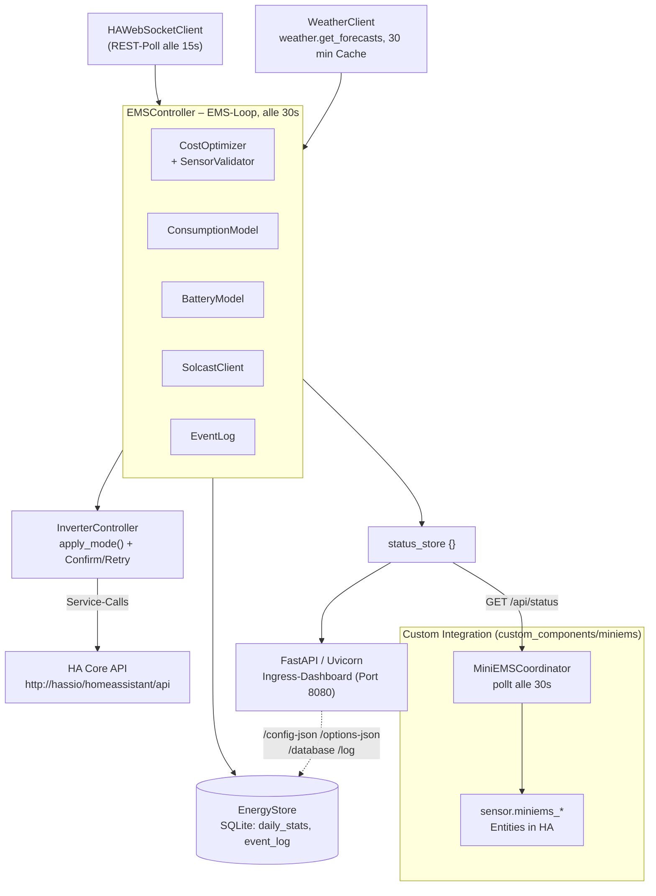
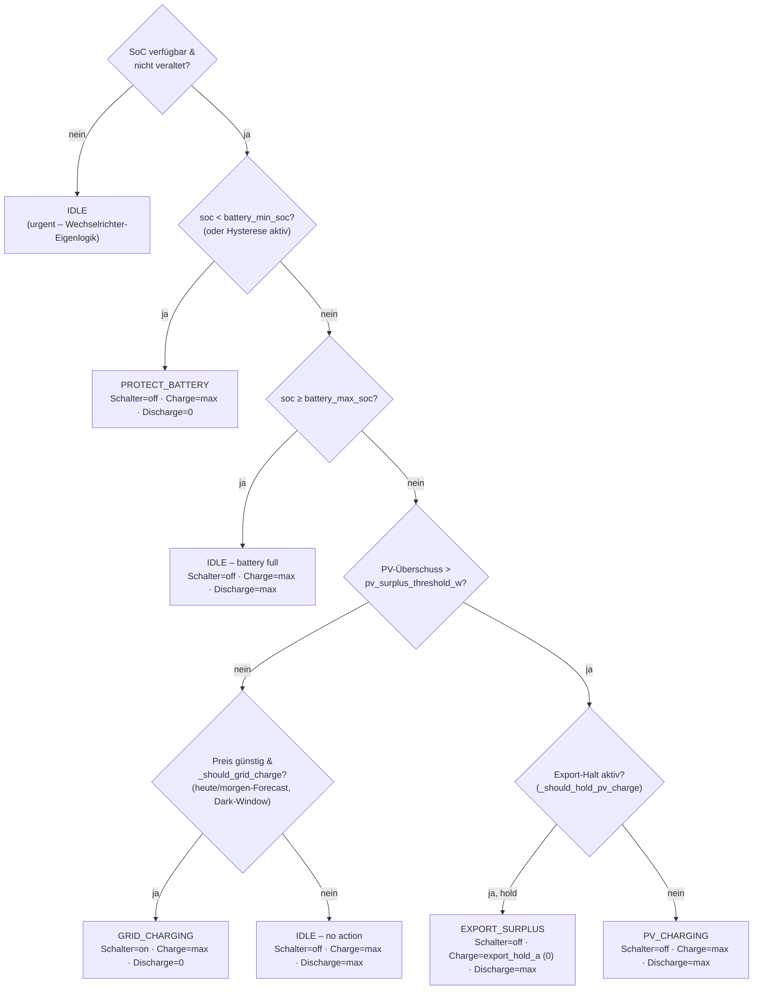
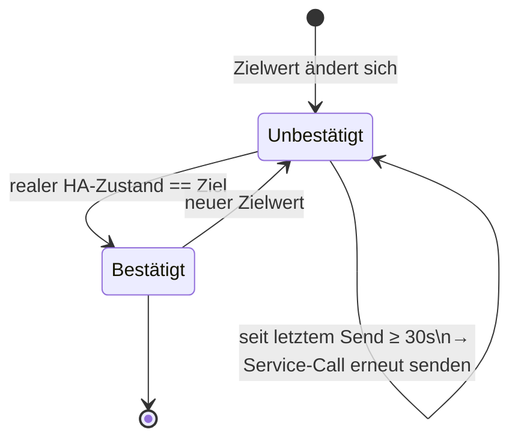

# Architektur

## Komponentenübersicht



`InverterController` und `HAWebSocketClient` sprechen beide direkt mit `HA Core API`; die `sensor.miniems_*`-Entities entstehen **nicht** durch einen Push aus dem Add-on, sondern werden von der Custom Integration per HTTP-Pull aus `/api/status` erzeugt (Details siehe Abschnitt „Sensor-Veröffentlichung" weiter unten).

## Asyncio-Task-Graph

Drei lang laufende Tasks werden nebenläufig ausgeführt:

```
asyncio.gather(
  ws_client.run()      # ruft HA-Zustände alle 15 s ab
  _ems_task()          # wartet auf ready → führt EMS-Loop alle 30 s aus
  uvi_server.serve()   # FastAPI / Uvicorn HTTP-Server auf Port 8080
)
```

`_ems_task` wartet auf `ws_client.wait_ready()` (ein `asyncio.Event`), bevor
er startet. Dadurch wird verhindert, dass der EMS mit veralteten oder leeren
Zustandsdaten läuft.

## Subsystem-Verdrahtung (pro Tick)

```
EMSController.update()
  │
  ├─ ws.get_state_value(...)        # Rohsensoren lesen (PV/Last/Grid/SoC/Preis/…)
  ├─ BatteryModel.free_to_charge()  # kWh-Headroom-Berechnung
  ├─ BatteryModel.useable()         # kWh Entladekapazität
  ├─ ConsumptionModel.predict()     # predicted_load_kwh + Quellbezeichnung (nutzt WeatherClient)
  ├─ _determine_mode()              # _decide() + _commit() → EMSMode (siehe „Entscheidungen & Steuerung")
  ├─ EventLog.append()              # bei Moduswechsel ODER Preisänderung
  ├─ InverterController.apply_mode()# Befehle senden + auf realen State bestätigen (siehe unten)
  ├─ CostOptimizer.record_tick()    # Energie-/Kosten-Akkumulatoren
  │    └─ SensorValidator.validate()#   verwirft Leistungs-Spikes NUR für die Kosten-/Energiebuchhaltung –
  │                                 #   die Moduslogik oben liest die Rohwerte ungefiltert
  └─ return status_store {}         # von web_server (/api/status) und der Custom Integration abgerufen
```

!!! note "SensorValidator läuft nicht auf dem Entscheidungspfad"
    `SensorValidator.validate()` wird von `CostOptimizer.record_tick()` aufgerufen, nicht direkt von `EMSController.update()`. Ein verworfener Leistungs-Spike beeinflusst also nur die Energie-/Kostenbuchhaltung — die Moduls-Entscheidung (`_decide`) arbeitet immer mit den ungefilterten Rohwerten aus `HAWebSocketClient` und verlässt sich stattdessen auf eigene Staleness-Prüfungen (siehe [Berechnungen](calculations.md)).

## Authentifizierungsablauf

```
SUPERVISOR_TOKEN  ──▶  http://hassio/homeassistant/api
       │ 401?
       ▼
long_lived_token  ──▶  http://hassio/homeassistant/api
       │ 401?
       ▼
    Fehler loggen, in 10 s erneut versuchen
```

Sowohl `HAWebSocketClient` (Lesezugriffe) als auch `InverterController`
(Schreibzugriffe) implementieren diesen Fallback unabhängig voneinander,
sodass jeder zur Laufzeit den Token wechseln kann.

`SUPERVISOR_TOKEN` wird außerdem verwendet von:

- `WeatherClient` — um `weather.get_forecasts` aufzurufen und den HA-Breitengrad abzurufen
- `web_server.py` — um `http://supervisor/core/api/config` nach der HA-Sprache
  (de/en Auto-Detection) abzufragen
- `integration_installer.py` — um die Custom-Integration-Dateien nach
  `/config/custom_components/miniems` zu installieren/aktualisieren

## Sensor-Veröffentlichung: Custom Integration (Pull)

`sensor.miniems_*`-Entities entstehen **nicht** durch einen Push vom Add-on
an HA, sondern über eine mitgelieferte HA-Custom-Integration
(`custom_components/miniems`, installiert von `integration_installer.py`):

| Komponente | Rolle |
|---|---|
| `MiniEMSCoordinator` (`DataUpdateCoordinator`) | Pollt `GET http://homeassistant:8080/api/status` (Standard alle 30 s) |
| `MiniEMSSensor` (`SensorEntity`) | Liest die gewünschten Felder aus dem Coordinator-Ergebnis (JSON von `status_store`) |

Es gibt aktuell **keinen** MQTT-Discovery- oder REST-Push-Mechanismus im Add-on selbst — Sensoren werden ausschließlich über diesen Pull-Weg erzeugt.

## Sensor-Validierung (SensorValidator)

Leistungswerte werden für die Kosten-/Energiebuchhaltung (nicht für die Moduslogik, siehe oben) bei jedem Tick validiert, um unplausible Spikes abzulehnen:

```
ablehnen wenn: |aktuell − letzter_akzeptierter_Wert| > 500 W  AND  |Δ| / letzter_akzeptierter_Wert > 50%
```

Abgelehnte Werte geben `None` zurück; `CostOptimizer` überspringt den Tick für diesen Sensor.
Jede Entity wird unabhängig verfolgt.

## Ausfallzeiten-Erkennung

Beim Start liest `CostOptimizer` `last_flush_ts` aus der SQLite-Tabelle `daily_stats`
(`EnergyStore`, `/data/miniems.db`). Wenn die Lücke zwischen `last_flush_ts` und
`datetime.now(timezone.utc)` mehr als zwei Update-Intervalle überschreitet, wird
eine Datenlücken-Warnung ausgelöst und im Warnungsbanner des Dashboards angezeigt.

## Entscheidungen & Steuerung

Die vollständigen Formeln und Schwellwerte stehen in [Berechnungen](calculations.md); die beiden Diagramme hier zeigen den Kontrollfluss auf einen Blick.

### Moduls-Entscheidung (`EMSController._decide`)



Jeder Zweig ist **fail closed**: Fehlt oder veraltet ein benötigter Sensorwert, gewinnt immer der sicherere Ausgang (kein Netzladen, kein Zurückhalten von PV-Ladung). `_commit()` entprellt einen neu vorgeschlagenen Modus zusätzlich über `mode_dwell_sec`, außer die Entscheidung ist `urgent` (SoC-Schutz, fehlender SoC-Sensor, ein durch eine Sicherheits-Guard beendeter Export-Halt).

### Wechselrichter-Schreibbestätigung (`InverterController`, seit v2.0.1)

Pro Kanal (Ladestrom, Entladestrom, Netzlade-Schalter) unabhängig — ein von HA angenommener Service-Call gilt erst als bestätigt, wenn der reale Zustand tatsächlich übereinstimmt:



`write_unconfirmed` (0–3) zählt live, wie viele Kanäle gerade unbestätigt sind; `write_errors` zählt getrennt echte HTTP-/Verbindungsfehler. Beide erscheinen als Warnung im Dashboard-Banner.

## Internationalisierung (i18n)

Bei jeder Seitenanfrage fragt `web_server.py` `http://supervisor/core/api/config`
ab, um die HA-Sprache (`language`-Feld) zu ermitteln. Die entsprechende YAML-Datei
(`translations/de.yaml` oder `translations/en.yaml`) wird geladen und sowohl in die
Jinja2-Templates als auch in das JavaScript-Objekt `const T` injiziert, sodass auch
dynamisch gerenderte Karten übersetzt werden.

Fallback-Reihenfolge: HA Supervisor API → `Accept-Language`-Header → Englisch.

## Dashboard- und API-Routen (`web_server.py`)

| Route | Zweck |
|---|---|
| `/` | Dashboard (HTML) |
| `/settings` | Einstellungsseite (HTML) |
| `/log` | Ereignisprotokoll (HTML) |
| `/database` | Datenbank-Viewer (HTML) |
| `/config-json`, `/options-json` | Rohdaten-Editoren (HTML) |
| `/api/status` | **Live-Statuswerte als JSON — wird von der Custom Integration gepollt** |
| `/api/database` | Datenbank-Auszug als JSON |
| `/api/config` (GET/POST) | Konfiguration lesen/schreiben |
| `/api/rawfile/{name}` (GET/POST) | Rohdatei-Editor (config.json/options.json) lesen/schreiben |
